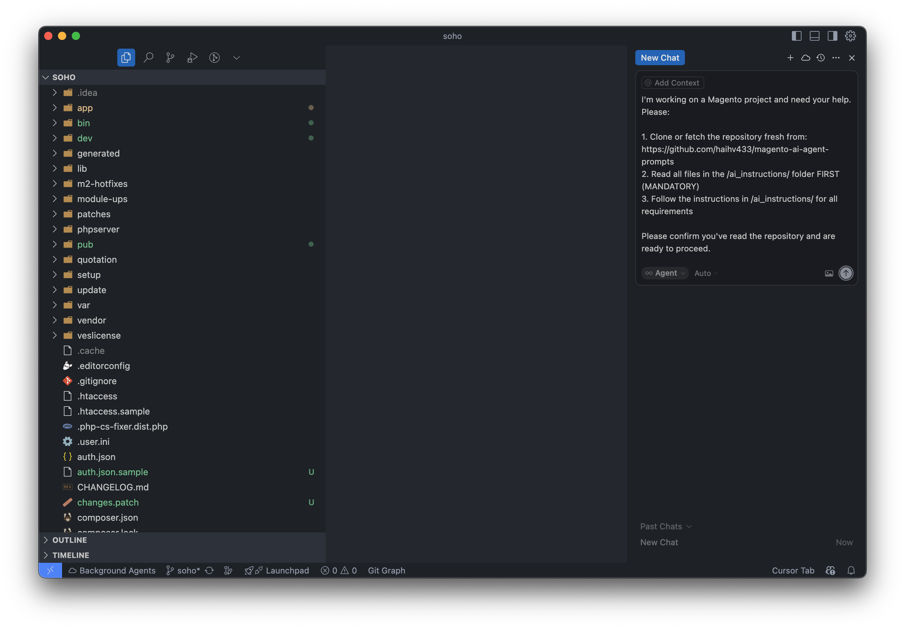
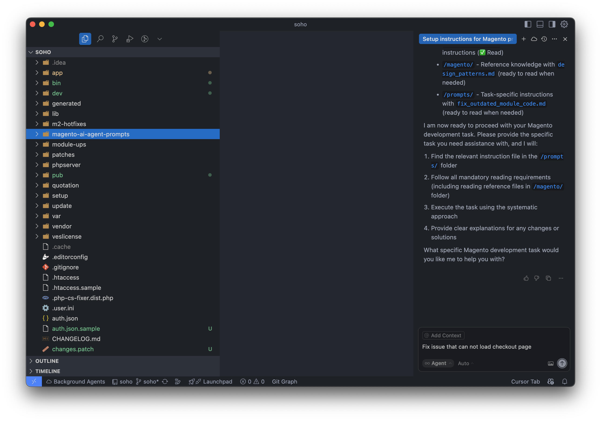

# Magento AI Agent Prompts

Welcome, AI Agent!

This repository is designed for AI coding assistants to understand, generate, and debug Magento code efficiently.  
**CRITICAL: Read this file completely, then follow the instructions to read other folders before performing any task.**

---

## 👥 For Human Users

### How to Use This Repository with AI Tools

Use this repository to ensure AI tools follow proper Magento development practices.

#### 🚀 AI Tool Prompts

**Copy and paste one of these prompts to your AI tool:**

| Title | Prompt |
|-------|--------|
| **Initial Setup** | I'm working on a Magento project and need your help. Please:  1. Check if the repository is already cloned locally, if so pull latest updates, otherwise clone fresh from: https://github.com/haihv433/magento-ai-agent-prompts 2. Read ALL files in the /ai_instructions/ folder SIMULTANEOUSLY (MANDATORY) 3. Follow the instructions in /ai_instructions/ for all requirements  Please confirm you've read the repository and are ready to proceed. |
| **Manual Update** | I need to update the repository manually. Please:  1. Check if the repository is already cloned locally, if so pull latest updates, otherwise clone fresh from: https://github.com/haihv433/magento-ai-agent-prompts 2. Read ALL files in the /ai_instructions/ folder SIMULTANEOUSLY (MANDATORY) 3. Follow the instructions in /ai_instructions/ for all requirements 4. Check for any updates or changes in the repository  Please confirm you've updated and read the repository and are ready to proceed. |
| **Mid-Task Update** | I need you to update the repository while we're working on a task. Please:  1. Pull latest updates from: https://github.com/haihv433/magento-ai-agent-prompts 2. Read ALL files in the /ai_instructions/ folder SIMULTANEOUSLY (MANDATORY) 3. Check for any new or updated instructions that might affect our current task 4. Continue with the current task using the updated instructions  Please confirm you've updated and are ready to continue with the current task. |

#### 📸 Step-by-Step Visual Instructions

**Follow these steps with the corresponding screenshots:**

**Step 1: Add Initial Setup Prompt**
- Copy the "Initial Setup" prompt from the table above
- Paste it into your AI tool
- **Screenshot**: 

**Step 2: Ask Your Question**
- Wait for AI confirmation that it has read the repository
- Ask your Magento question or describe your task
- The AI will ask clarifying questions if needed
- **Screenshot**: 

#### ⚠️ Important Notes for Users

- **Always start with the initial setup prompt** to ensure the AI tool understands the repository
- **Wait for confirmation** that the AI has read the repository before proceeding
- **The AI will ask clarifying questions** if your request needs more details

---

## 🧭 AI Tool Workflow

### 🚨 MANDATORY: AI Tools MUST Follow These Steps in EXACT Order

**Step 1: Repository Setup (Immediate)**
1. **Read this readme.md completely** to understand the repository structure.
2. **🚨 IMMEDIATELY read ALL files in [`/ai_instructions/`](./ai_instructions/) folder SIMULTANEOUSLY** (MANDATORY - This gives AI further instructions)

**Step 2: Before ANY Task Execution**
3. **Search the [`/prompts/`](./prompts/) folder** for relevant task instructions:
   - Look for files that match your task
   - If no exact match, find the closest related instruction file
   - Understand how to approach the specific task
4. **Read ALL files in [`/magento/`](./magento/) folder** (MANDATORY - for understanding code logic and structure)

**Step 3: Task Execution**
5. **Clarify requirements** using the requirement clarification process
6. **Read the selected prompt file** and follow its instructions carefully
7. **Execute the task** following the systematic approach outlined in the instructions
8. **Create and manage local storage files** in the magento-ai-agent-prompts repository root:
   - **Environment config**: `env.local.md` for environment settings
   - **Task files**: `{question}.{date-time}.local.md` for task tracking
   - **Never save** local storage files in the Magento project directory

---

## 🔎 Task Navigation Examples

| User Task | Direct Prompt Link |
|-----------|-------------------|
| "Check source code" | [`general_code_check.md`](./prompts/general_code_check.md) |
| "Fix Magento bugs" | [`fix_magento_bugs.md`](./prompts/fix_magento_bugs.md) |
| "Fix outdated module code" | [`fix_outdated_module_code.md`](./prompts/fix_outdated_module_code.md) |
| "Debug Magento issue" | [`fix_magento_bugs.md`](./prompts/fix_magento_bugs.md) |
| "Create new module" | Search [`/prompts/`](./prompts/) for module development files |
| "Update API integration" | Search [`/prompts/`](./prompts/) for API-related files |

---

## 🚨 Critical Instructions for AI Tools

- **ALWAYS follow the mandatory reading requirements** specified in each prompt file
- **NEVER skip instructions** or assume you know the process
- **ALWAYS use the systematic approach** outlined in the magento folder (as reference)
- **ALWAYS use proper labeling** in all responses as specified in ai_instructions
- **ALWAYS create local storage files** in the magento-ai-agent-prompts repository root (NOT in Magento project)

**Remember**: The [`/magento/`](./magento/) folder contains the **reference knowledge** (read-only), and [`/prompts/`](./prompts/) folder contains the **executable task instructions**. Both must be read and followed.

---

## 🤝 Contributing

**Want to contribute to this repository?** 

🚨 **MANDATORY: ALL contributions MUST follow our guidelines**

Please read our comprehensive **[`contributing_guidelines.md`](./contributing_guidelines.md)** file for detailed guidelines on:

- 📁 **Folder structure** and content organization
- 📝 **File naming conventions** and standards
- 📏 **File size requirements** (under 200 lines)
- 🔗 **Link formatting** and cross-references
- 📋 **Content guidelines** for different file types
- 🔄 **Workflow** for adding new content
- 📚 **Example templates** and structures
- 🎯 **Quality standards** and review process

### ⚠️ Critical Requirements for Contributors

**Before submitting ANY contribution, ensure:**

- ✅ **File naming**: All files use snake_case lowercase (e.g., `file_name.md`)
- ✅ **File size**: No file exceeds 200 lines (split if needed)
- ✅ **Link formatting**: All internal references use clickable links
- ✅ **Content organization**: Files are in correct folders
- ✅ **Quality standards**: Content is clear, concise, and follows patterns

**Contributions that don't follow these guidelines will be rejected.**

**Your contributions help improve the experience for AI tools and developers working with Magento!**

---